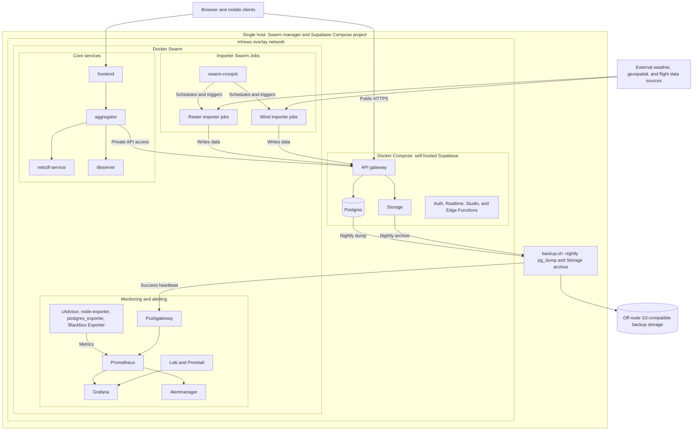

# infra/

Operational infrastructure for this project — Docker Swarm orchestration,
self-hosted Supabase, backups, and monitoring/alerting.

## Architecture



The Docker Compose Supabase project is not a Swarm service; it shares the
`mhews` overlay network with the Swarm stacks so internal services use the
private API gateway while browsers and mobile clients use Supabase's public
HTTPS endpoint. Grafana visualizes Prometheus metrics and Loki logs; Prometheus
also evaluates the backup heartbeat sent through Pushgateway and forwards
alerts to Alertmanager.

## Layout

| Folder | What it is | Read first |
|---|---|---|
| [`infra/swarm/`](./infra/swarm/README.md) | Docker Swarm bootstrap, core services, all importer Jobs, the `swarm-cronjob` scheduler (not yet added) | `infra/swarm/README.md` |
| [`infra/supabase/`](./infra/supabase/README.md) | Self-hosted Supabase, plain Docker Compose, on the same machine as the Swarm manager | `infra/supabase/README.md` |
| [`infra/backups/`](./infra/backups/README.md) | Nightly Postgres + Storage backups, off-node, with restore drills (not yet added) | `infra/backups/README.md` |
| [`infra/monitoring/`](./infra/monitoring/README.md) | Prometheus, Grafana, Alertmanager, Loki/Promtail, exporters (not yet added) | `infra/monitoring/README.md` |

## Prerequisites

- Docker Engine **20.10+** on the node (Swarm Jobs — `--mode
  replicated-job`/`global-job` — require this; older Engines can join the
  Swarm but can't run Job-mode services).
- Outbound network access from this node to: NOAA NOMADS/NCEP, Copernicus
  CDS/CAMS/Marine, HDX, Microsoft's building-footprints blob storage,
  OpenStreetMap/Overpass, and whatever off-node backup storage target you
  choose (§`infra/backups/`). Supabase shares the `mhews` overlay network
  with the Swarm stacks on the same node instead of a separate network
  path — see `infra/supabase/README.md`.

## Install order

Run these from the repo root, on the target node:

```sh
cd infra
sudo ./install-docker.sh        # installs Docker Engine, inits this node as a Swarm manager
sudo ./install-network.sh       # creates the attachable 'mhews' Swarm overlay network
cd supabase
sudo ./setup.sh                      # see infra/supabase/README.md for the full walkthrough
```

`infra/supabase/README.md` covers the rest in detail, including the
interactive URL/domain prompts, the free `sslip.io` option if you don't have
a domain yet, and the firewall/Security Group ports each option needs open.
